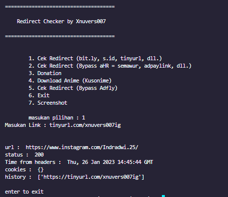
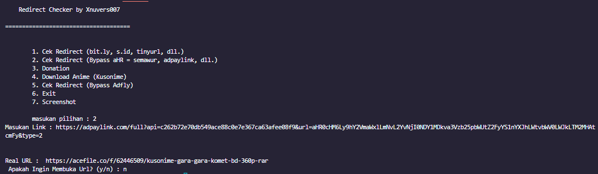
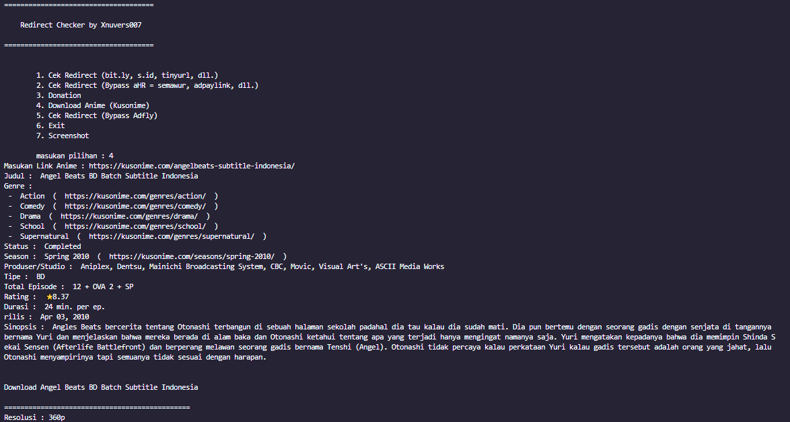
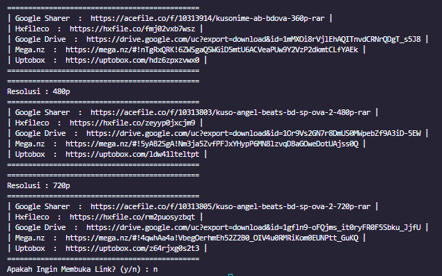
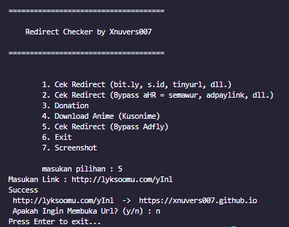

# Bypass Url

Repository ini adalah Repo untuk membypass url yang ada banyak iklan sehingga memudahkan untuk mencari link yang sebenarnya tanpa repot repot

aplikasi tools ini dibuat dengan menggunakan python 3.11

# Cara Install
## Windows
- 1. Download Python -> [Download Disini](https://www.python.org/downloads/)
- 2. Install Python
- 3. Download Repo ini -> [Download Disini](https://github.com/Xnuvers007/bypassurl/archive/refs/heads/main.zip)
- 3.1 jika kalian sudah mendownload git, kalian bisa clone repo ini dengan cara **```git clone https://github.com/Xnuvers007/bypassurl```** , jika kalian belum mendownload git, kalian bisa mendownload git [disini](https://git-scm.com/downloads)
- 4. Buka folder repo ini atau jika menggunakan CMD kalian bisa menggunakan perintah **```cd bypassurl```**
- 5. Install requirements.txt dengan cara **```pip install -r requirements.txt```** jika kalian lupa, tenang saja, di script ini sudah ada fitur untuk menginstall requirements.txt
- 6. Jalankan script dengan cara **```python main.py```**

## Linux
- 1. Download Python -> ``` sudo apt install python3 ```
- 2. Download Git -> ``` sudo apt install git ```
- 3. Download Repo ini -> ``` git clone https://github.com/Xnuvers007/bypassurl ```
- 4. Buka Folder Repo Ini -> ```cd bypassurl```
- 5. Install requirements.txt -> ```pip install -r requirements.txt``` jika kalian lupa, tenang saja, di script ini sudah ada fitur untuk menginstall requirements.txt
- 6. Jalankan script dengan cara ```python main.py```

# List Bypass url Now (26-01-2023)

- [&check;] 1. s.id , bit.ly, dll.
- [&check;] 2. adf.ly
- [&check;] 3. aHR (Semawur, adpaylink, dll)

## Gambar

- 1. Cek Redirect (bit.ly, s.id, dll)



- 2. Cek redirect (Bypass aHR = semawur, adpaylink, dll)



- 3. Download Anime (Kusonime)




- 4. Cek Redirect (Bypass Adfly)


